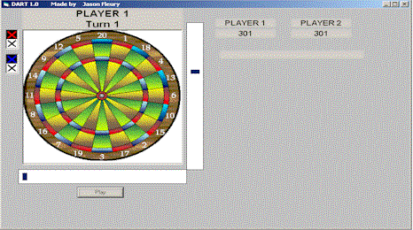



## A Dart board Game

### Description

The First Dart Game on Visual Basic made for your own pleasure...........

Playing 301 and 501 Game's

Using BitBlt and maths function
 
### More Info
 

             |
---                |---
**Submitted On**   |1999-11-14 12:37:52
**By**             |[Jason Fleury](https://github.com/Planet-Source-Code/PSCIndex/blob/master/ByAuthor/jason-fleury.md)
**Level**          |Intermediate
**User Rating**    |4.1 (77 globes from 19 users)
**Compatibility**  |VB 5\.0, VB 6\.0
**Category**       |[Games](https://github.com/Planet-Source-Code/PSCIndex/blob/master/ByCategory/games__1-38.md)
**World**          |[Visual Basic](https://github.com/Planet-Source-Code/PSCIndex/blob/master/ByWorld/visual-basic.md)
**Archive File**   |[CODE\_UPLOAD1812\.zip](https://github.com/Planet-Source-Code/jason-fleury-a-dart-board-game__1-4455/archive/master.zip)

